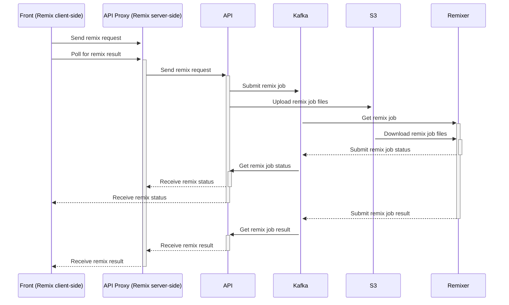

# Tereus System Design

```mermaid
sequenceDiagram
    Front (Remix client-side)->>+API Proxy (Remix server-side): Send remix request
    Front (Remix client-side)->>+API Proxy (Remix server-side): Poll for remix result
    API Proxy (Remix server-side)->>+API: Send remix request
    API->>+Kafka: Submit remix job
    API->>+S3: Upload remix job files
    Kafka->>+Remixer: Get remix job
    S3->>+Remixer: Download remix job files
    Remixer-->>-Kafka: Submit remix job status
    Kafka->>+API: Get remix job status
    API-->>-API Proxy (Remix server-side): Receive remix status
    API-->>-Front (Remix client-side): Receive remix status
    Remixer-->>-Kafka: Submit remix job result
    Kafka->>+API: Get remix job result
    API-->>-API Proxy (Remix server-side): Receive remix result
    API Proxy (Remix server-side)-->>-Front (Remix client-side): Receive remix result
```
