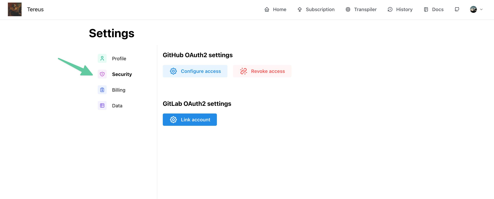

# Authentication

To start using Tereus, you will need to sign up using either your Github or Gitlab account.

You will be able to link your account to your Github or Gitlab account once you have signed up.

To see your Oauth account settings, you can go to the security tab of your settings:

