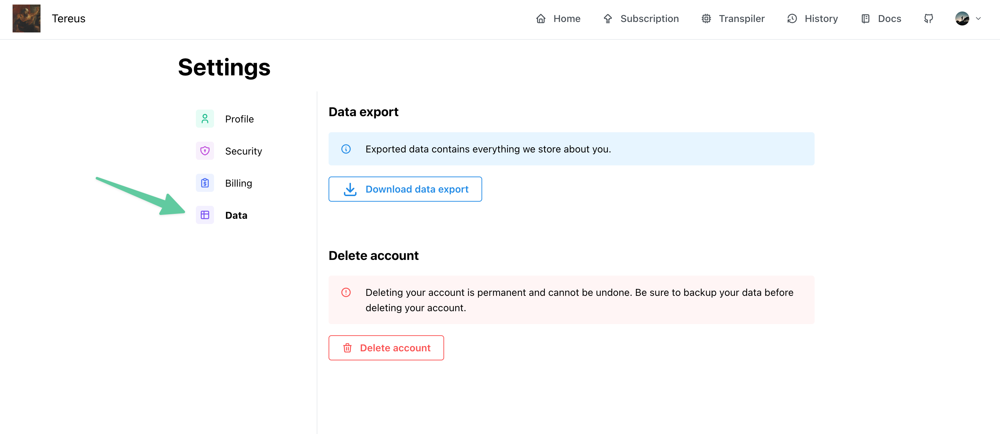

# Data handling

## Data export

The data export feature will allow you to export your data to a JSON files, along all your original source code and transpilations.

:::info Retention
Of course, if you past submissions have been deleted according to the retention policy, you will not be able to export them.
:::

## Account deletion

Using the delete account button, you are able to permanently delete your account and all your data.

:::warning Warning
This action is irreversible! We won't be able to restore your data.
:::
