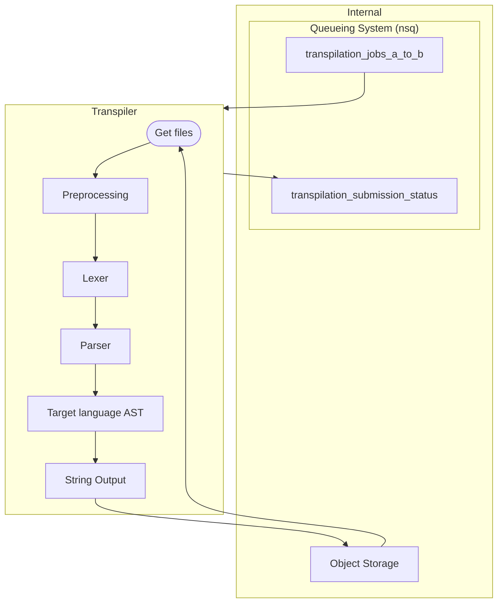

# How it works

Tereus transpilers mostly works like a compiler but instead of generating machine code, it generates text.

We use ANLTR to parse the source code into a AST (Abstract Syntax Tree).

> ANTLR (ANother Tool for Language Recognition) is a powerful parser generator for reading, processing, executing, or translating structured text or binary files.
>
> https://github.com/antlr/antlr4

## Architecture



## How to add a supported feature to the transpiler

Let's say we want to support the `continue` keyword for the c-to-go compiler.

We need to add the `continue` keyword to the `C.g4` grammar.

```antlr title="C.g4"
statement: (
		(
			variableDeclaration
			| expression
			| functionReturn
			| 'break'
// highlight-start
			| 'continue'
// highlight-end
			| structDeclaration
			| enumDeclaration
			| gotoStatement
		) ';'
	)
	| ifStatement
	| forStatement
	| whileStatement
	| block
	| labelStatement
	| BlockComment
	| LineComment;
```

```antlr title="C.g4"
Break: 'break';
Case: 'case';
Char: 'char';
Const: 'const';
// highlight-start
Continue: 'continue';
// highlight-end
Default: 'default';
```

Then, we will need to regerate our Go parser using ANTLR:

```sh
java -Xmx500M -cp "./bin/antlr-4.9-complete.jar" org.antlr.v4.Tool \
    -Dlanguage=Go \
    -no-listener \
    -visitor \
    -o parser \
    C.g4
```

We now have a have a bunch of updated files in the `/parser` directory, where the ANTLR generated code lies.

The next step is to handle the `continue` statement in the AST.

```go title="transpiler/ast/continue.go"
package ast

type ASTContinue struct{}

func NewASTContinue() *ASTContinue {
	return &ASTContinue{}
}
```

Then, we have to handle the `String()` method, which is used to generate the text representation of the AST.

```go title="transpiler/ast/continue.go"
package ast

type ASTContinue struct{}

func NewASTContinue() *ASTContinue {
	return &ASTContinue{}
}
// highlight-start
func (b *ASTContinue) String() string {
	return "continue"
}
// highlight-end
```

Then, we have to make sure that the `ASTContinue` is matched when visit a statement.

```go title="transpiler/visitor.go"
func (v *Visitor) VisitStatement(ctx *parser.StatementContext) (ast.IASTItem, error) {
	if child := ctx.VariableDeclaration(); child != nil {
		variableDeclaration, err := v.VisitVariableDeclaration(child.(*parser.VariableDeclarationContext))
		if err != nil {
			return nil, err
		}

		return variableDeclaration, nil
	} else if child := ctx.Expression(); child != nil {
		return v.VisitExpressionWithConfigurableIsStatement(child, true)
	} else if child := ctx.FunctionReturn(); child != nil {
		return v.VisitFunctionReturn(child.(*parser.FunctionReturnContext))
	} else if child := ctx.Break(); child != nil {
		return ast.NewASTBreak(), nil
// highlight-start
	} else if child := ctx.Continue(); child != nil {
		return ast.NewASTContinue(), nil
// highlight-end
	} else if child := ctx.StructDeclaration(); child != nil {

[...]
```

That's it!

To make sure our new `continue` keyword is supported, we can add some tests:

```go title="transpiler/transpiler_test.go"
func TestContinue(t *testing.T) {
	source := `
int main() {
	int a = 1;
	while (a < 10) {
		a++;
		if (a == 5) {
			continue;
		}
	}
	return 0;
}
`

	target := `
package main
import (
	"os"
)
func main() {
	a := 1
	for a < 10 {
		a++
		if a == 5 {
			continue
		}
	}
	os.Exit(0)
}
`

	testRemix(t, source, target)
}
```

And that's it!

```
» go test -v -run ^TestContinue$ github.com/tereus-project/tereus-transpiler-c-go/transpiler
=== RUN   TestContinue
--- PASS: TestContinue (0.01s)
PASS
ok      github.com/tereus-project/tereus-transpiler-c-go/transpiler     0.010s
```

## `transpiler-std`: the base transpiler skeleton

Our transpilers follow a common structure pattern and have to implement a set of identical features such as communicating with the queueing system, object storage, etc.

To prevent code duplication and to make it easier to maintain, we have a base transpiler skeleton that can be used as a starting point.

It is available on Github at [tereus-project/tereus-transpiler-std](https://github.com/tereus-project/tereus-transpiler-std/).

It handles the following features:

- environment variables & config
- object storage (S3)
- messaging (getting new jobs, submitting status, etc.)
- prometheus metrics
- error reporting to sentry
- the overall transpilation flow

This allows to make the transpilers simpler and easier to maintain, which a focus on the actual transpilation logic.

For example, our C to Go transpiler has the following `main()`:

```go title="main.go"


package main

import (
	"github.com/tereus-project/tereus-transpiler-c-go/transpiler"
	"github.com/tereus-project/tereus-transpiler-std/core"
)

func main() {
	core.InitTranspiler(&core.TranspilerContextConfig{
		SourceLanguage:              "c",
		SourceLanguageFileExtension: ".c",
		TargetLanguage:              "go",
		TargetLanguageFileExtension: ".go",
		TranspileFunction:           transpiler.Remix,
	})
}
```

As you can see, it is very simple. The transpiler only has to implement the `TranspileFunction` function, which is called when a new job is received.

For this transpiler, it looks like this:

```go title="transpiler.go"
func Remix(entrypoint string) (string, error) {
	preprocessor, err := NewPreprocessor(entrypoint)
	if err != nil {
		return "", err
	}

	preprocessed, err := preprocessor.Preprocess()
	if err != nil {
		return "", err
	}

	visitor := NewVisitor(entrypoint, preprocessed)

	input := antlr.NewInputStream(visitor.Code)
	lexer := parser.NewCLexer(input)
	stream := antlr.NewCommonTokenStream(lexer, 0)
	p := parser.NewCParser(stream)
	p.Interpreter.SetPredictionMode(antlr.PredictionModeSLL)
	p.RemoveErrorListeners()

	errorListener := NewRemixerErrorListener(entrypoint)
	p.AddErrorListener(errorListener)

	tree := p.Translation()

	if len(errorListener.Errors) > 0 {
		return "", fmt.Errorf("%s", strings.Join(errorListener.Errors, "\n"))
	}

	output, err := visitor.VisitTranslation(tree.(*parser.TranslationContext))
	if err != nil {
		return "", err
	}

	return output, nil
}
```

Here we can see that we only have the transpiling logic (lexer, parser, visitor, etc.).

### Github template for a transpiler

We crated a transpiler template git repository on Github, that is based on the `transpiler-std` skeleton.

It is available on Github at [tereus-project/tereus-transpiler-template](https://github.com/tereus-project/tereus-transpiler-template/).
